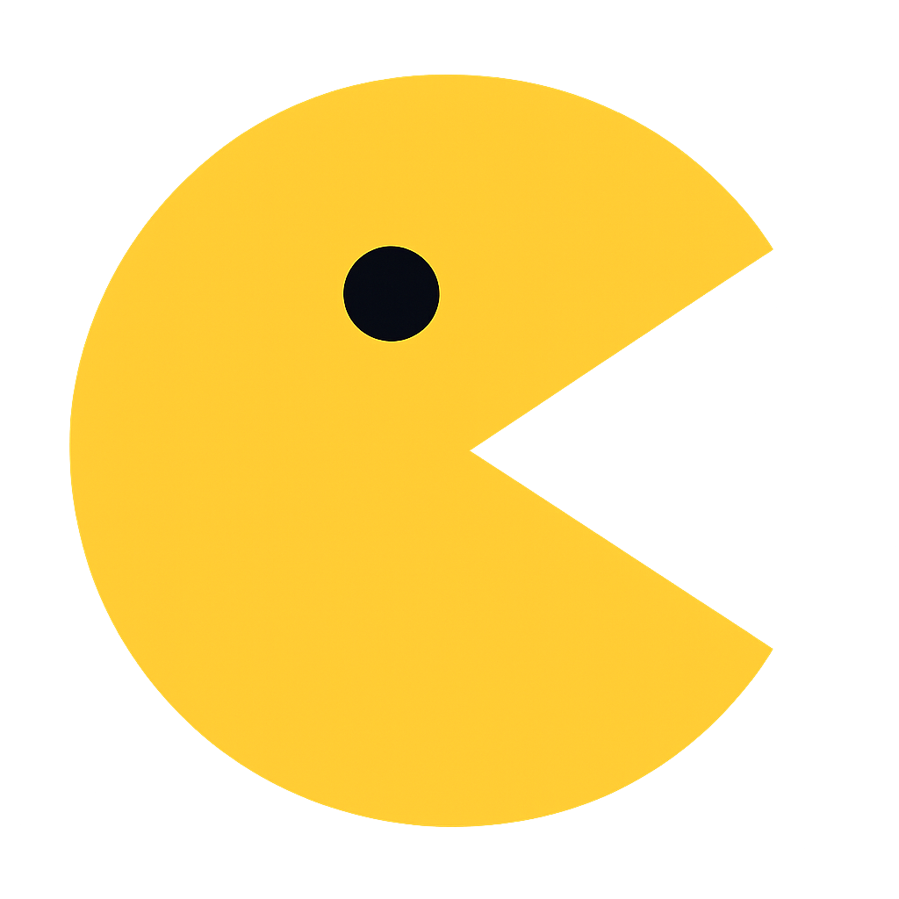

<p align="center">
  
</p>

# Pacman

Transform your gaming ideas into full-stack multiplayer experiences with real-time performance

## What is Pacman?

Pacman is an open-source real-time multiplayer shooting game that demonstrates high-performance game development using modern web technologies and Go backend services. It's built for developers who want to understand how to create low-latency multiplayer games with WebSocket communication and protobufs.

## 🎮 Live Demo & Controls

**[Play Pacman](https://battle-arena.akashgupta.tech)**

### Game Controls
- **WASD / Arrow Keys** - Move player
- **Space** - Shoot bullets

## Tech Stack

Pacman is built with modern and reliable technologies:

### Frontend
- **Framework**: Next.js 15, React 19, TypeScript
- **Styling**: Tailwind CSS with custom animations
- **Game Rendering**: Canvas-based renderer with 60fps game loop
- **State Management**: Custom hooks for game logic and WebSocket management

### Backend
- **Language**: Go 1.23.2
- **WebSocket**: Gobwas/ws for high-performance connections
- **Data Serialization**: Protocol Buffers for efficient message delivery
- **Game Engine**: Custom game loop with collision detection and physics

### Communication
- **Protocol**: WebSocket with binary message support
- **Message Format**: Protocol Buffers for type-safe, compressed data
- **Real-Time Updates**: 16ms movement intervals for smooth gameplay

## Getting Started

### Prerequisites

**Required Versions:**
- [Node.js](https://nodejs.org/en/download) (v18 or higher)
- [npm](https://www.npmjs.com) (v10 or higher)
- [Go](https://golang.org/dl/) (v1.23 or higher)

### Setup Instructions

1. **Clone the Repository**
   ```bash
   git clone https://github.com/akashwarrior/pacman.git
   cd pacman
   ```

2. **Set Up Environment Variables**
   
   **Frontend Setup:**
   ```bash
   cd frontend
   cp .env.example .env.local
   # Edit .env with your configuration
   ```
   
   **Backend Setup:**
   ```bash
   cd backend
   cp .env.example .env
   # Edit .env with your configuration
   ```

3. **Start the Backend Server**
   ```bash
   cd backend
   go mod tidy
   go run .
   ```
   The server will start on port 8080

4. **Start the Frontend Application**
   ```bash
   cd frontend
   npm install
   npm run dev
   ```
   The application will be available at [http://localhost:3000](http://localhost:3000)

5. **Open in Browser**
   Visit [http://localhost:3000](http://localhost:3000) to start playing

### Game Customization
- Modify game constants in `frontend/src/lib/constants/gameConfig.ts`
- Adjust game physics in `backend/game.go`
- Customize rendering in `frontend/src/lib/renderer.ts`

## Contributing

1. Fork the repository
2. Create a feature branch (`git checkout -b feature/amazing-feature`)
3. Commit your changes (`git commit -m 'Add amazing feature'`)
4. Push to the branch (`git push origin feature/amazing-feature`)
5. Open a Pull Request

---

**Built with ❤️ using Next.js and Go**