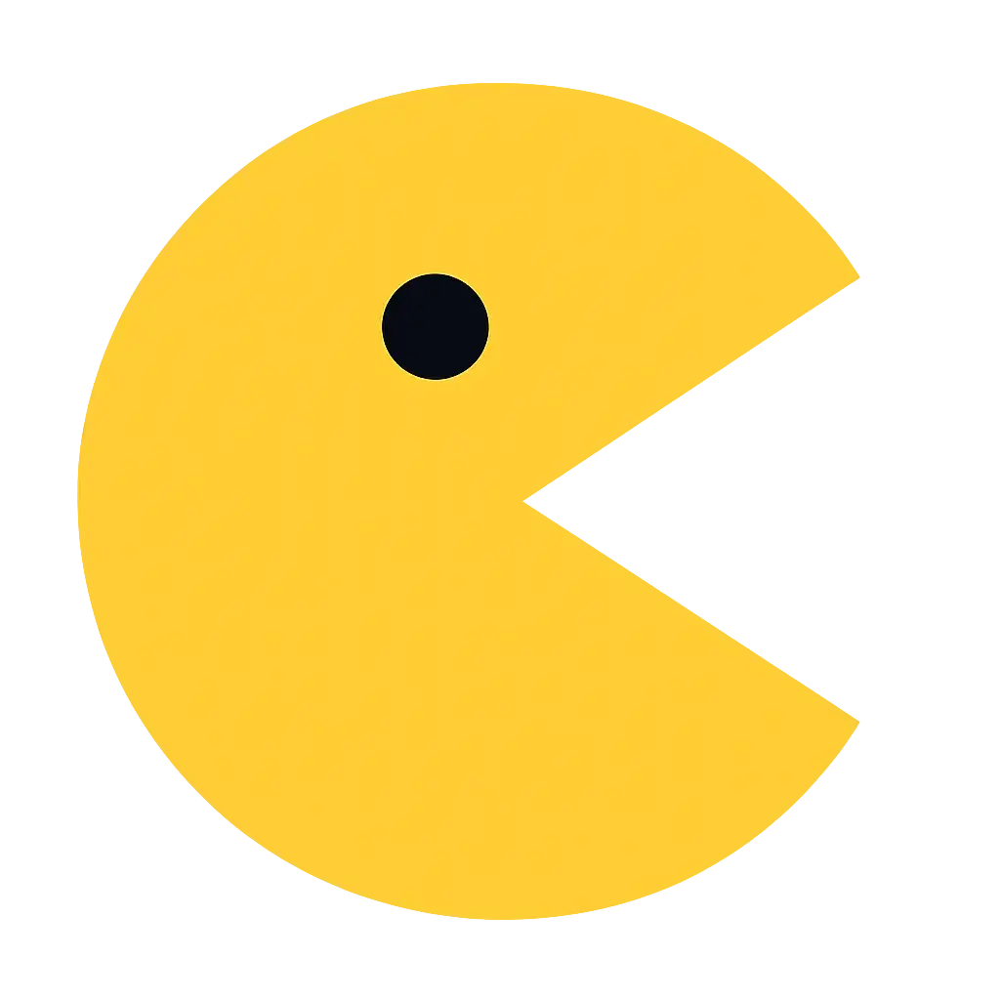

<p align="center">
  
</p>

<h1 align="center">Pacman</h1>

<p align="center">
  <strong>Real-time multiplayer arena shooter with classic Pacman characters</strong>
</p>

<p align="center">
  <a href="https://pacman.akashgupta.tech">Live Demo</a> •
  <a href="#getting-started">Getting Started</a> •
  <a href="#tech-stack">Tech Stack</a> •
  <a href="#contributing">Contributing</a>
</p>

---

## About

Pacman is an open-source multiplayer battle game where players control Pacman-style characters in fast-paced arena combat. Built with modern web technologies, it showcases real-time game development with WebSocket communication and Protocol Buffers.

### Features

- **Real-time Multiplayer** - Up to 6 players per room
- **Low Latency** - 16ms tick rate with binary WebSocket messages
- **Canvas Rendering** - Smooth 60fps gameplay
- **Room System** - Create or join game rooms
- **Responsive** - Works on desktop browsers

## Getting Started

### Prerequisites

- [Node.js](https://nodejs.org/) 18+ (with pnpm recommended)
- [Go](https://golang.org/) 1.23+

### Installation

```bash
# Clone repository
git clone https://github.com/akashwarrior/pacman.git
cd pacman

# Setup backend
cd backend
cp .env.example .env
go run .

# Setup frontend (new terminal)
cd frontend
cp .env.example .env.local
pnpm install
pnpm dev
```

Open [http://localhost:3000](http://localhost:3000) to play.

### Controls

| Key | Action |
|-----|--------|
| `W` `A` `S` `D` / Arrow Keys | Move |
| `Space` | Shoot |

## Tech Stack

| Layer | Technology |
|-------|------------|
| Frontend | Next.js 16, React 19, TypeScript, Tailwind CSS 4 |
| Backend | Go, gobwas/ws, Protocol Buffers |
| Rendering | Canvas 2D API |
| Communication | WebSocket (binary), Protobuf |

## Project Structure

```
pacman/
├── frontend/               # Next.js application
│   ├── src/
│   │   ├── app/           # Pages & routing
│   │   ├── components/    # UI components
│   │   ├── hooks/         # Game & room hooks
│   │   ├── lib/           # Renderer, constants
│   │   ├── services/      # API & WebSocket
│   │   └── types/         # TypeScript & Protobuf
│   └── public/map/        # Arena maps
│
└── backend/               # Go game server
    ├── main.go            # HTTP server
    ├── room.go            # Game rooms & logic
    ├── game.go            # Physics & collision
    ├── player.go          # Player state
    └── map/               # Server-side maps
```

## Configuration

### Backend `.env`

```env
PORT=8080
ALLOWED_ORIGINS=http://localhost:3000
ROOM_IDLE_TIMEOUT=300
MAX_REQUEST_BODY=4096
```

### Frontend `.env.local`

```env
NEXT_PUBLIC_BACKEND_URL=http://localhost:8080
NEXT_PUBLIC_WS_URL=ws://localhost:8080/api/play
```

## Contributing

Contributions are welcome! Please feel free to submit a Pull Request.

1. Fork the project
2. Create your feature branch (`git checkout -b feature/new-feature`)
3. Commit changes (`git commit -m 'Add new feature'`)
4. Push to branch (`git push origin feature/new-feature`)
5. Open a Pull Request

## License

This project is open source.

---

<p align="center">
  Made with ❤️ by <a href="https://github.com/akashwarrior">Akash</a>
</p>